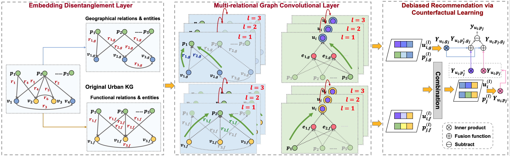
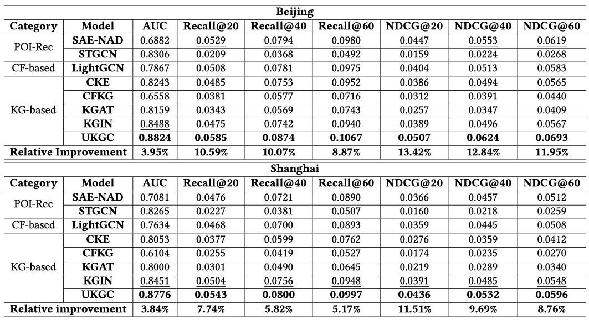
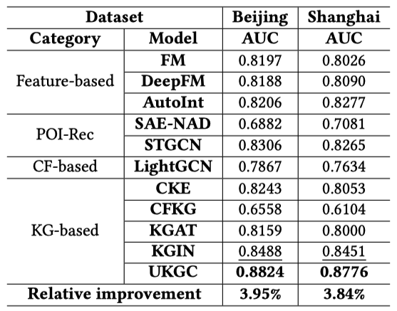

# UKGC

Point-of-Interest (POI) recommendation, an important web service for suggesting potential locations to users, faces challenges stemming from the absence of well-constructed comprehensive information for POI and user modeling. In this paper, we bridge these gaps by constructing the Urban Knowledge Graph (UrbanKG) based on real-world large-scale data that contains structured geographical and functional information of POIs. We further propose a graph convolutional network-based model named UKGC (short for \textit{\textbf{U}rban \textbf{K}nowledge \textbf{G}raph based \textbf{C}ounterfactual Recommendation}), which aims to learn disentangled POI and user representations corresponding to their geographical and functional features (interests). Its counterfactual learning module alleviates the negative impact of geographical proximity on the inference of users' intrinsic preferences from a causal perspective. We conduct experiments on two datasets from Beijing and Shanghai, and our model shows superior performance compared to state-of-the-art approaches.



## Installation

### Environment
- Tested OS: Linux
- Python >= 3.6
- PyTorch >= 1.7.0

### Training

Run our model on Beijing dataset:
```
cd Codes
python main.py --dataset beijing
```
Run our model on Shanghai dataset:
```
cd Codes
python main.py --dataset shanghai
```
The results will be printed in the terminal automatically.

### Performance

We evaluate the top-$K$ recommendation performance of models by full-ranking strategy. We utilize two widely-accepted ranking metrics, Recall@$K$ and NDCG@$K$. Due to the large scale of our dataset, $K$ is selected in $\{20, 40, 60\}$. However, the full-ranking task for traditional feature-based methods such as FM, DeepFM, and AutoInt is not applicable due to the extremely high computational cost of constructing samples for each user-POI pair on the large-scale dataset. Therefore, we use the AUC metric to evaluate these models with sampled negative items.
<div style="text-align: center;">
  
</div>
<div style="text-align: center;">
  
</div>

### License
The software in this repository is freely available under MIT license. Please see the LISENCE file for further details.